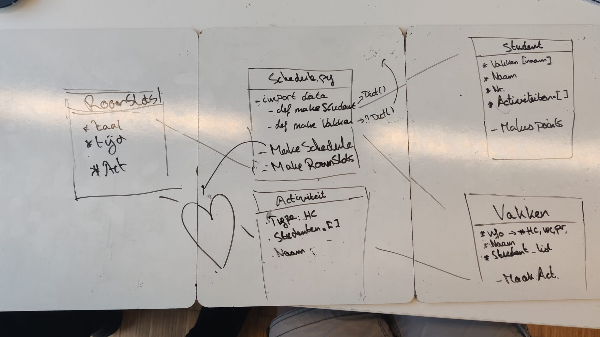
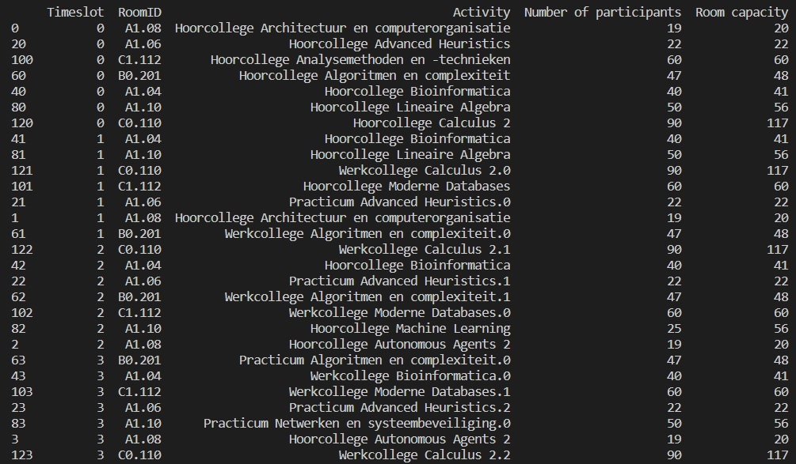

# LecturesLesroosters-DeRoosterRegering
The compilation of schedules can be hard. A schedule contains information on courses, activitities, students, rooms and timeslots. This repository contains code that compiles a weekschedule for a subject list on the FNWI, part of the University of Amsterdam. It must conform to constraints: all activities should have a roomslot (room at a certain time), a roomslot can be used for a single activity and students may not have three gap hours in their personal weekschedule. The goal is to limit the number of maluspoints (MP), which are used to score the schedule. Maluspoints can be received on various occasions:
- 1 MP when a student has two simultaneous activities.
- 1 MP when a students has a gap hour.
- 3 MP when a student has two gap hours.
- 1 MP when the number of participants of an activity exceeds the capacity of a room.
- 5 MP when the eveningslot (17-19h) is used by room C1.110.

## Let's get started
### Requirements
This code was written in Python 3.8. requirements.txt contains all packages that are needed to run the code. These packages can be installed using:
```
pip install -r requirements.txt
```

## Usage
The code can be used by running:
```
python3 main.py [arg]
```

[arg] can be replaced by:
- **random**: construct a schedule with random placement of activities and students
- **greedy_topdown**: construct a schedule that places the greatest groups of activities into the biggest rooms.
- **greedy_bottomup**: construct a schedule that places the smallest groups of activities into the smallest rooms.
 - **random_hillclimber**: apply a hillclimber to a random schedule.
 - **greedy_topdown_hillclimber**: apply a hillclimber to a greedy topdown schedule.
 - **greedy_bottomup_hillclimber**: apply a hillclimber to a greedy bottomup schedule.

## Structure
The most important files are:
- **/code**: contains all code
    - **/algorithms**: contains all code used for the algorithms
    - **/classes**: contains all classes that are used in this case
- **/data**: contains datafiles necessary for compiling a schedule
- **/images**: contains visualization of the resuls

## Representation
### Overview of classes


*Overview of the classes that are used for this case.*

### Timeslot clarification
| Time | Monday | Tuesday | Wednesday | Thursday | Friday |
| :---: | :---: | :---: | :---: | :---: | :---: |
| 9 - 11 | 0 | 5 | 10 | 15 | 20 |
| 11 - 13 | 1 | 6 | 11 | 16 | 21 |
| 13 - 15 | 2 | 7 | 12 | 17 | 22 |
| 15 - 17 | 3 | 8 | 13 | 18 | 23 |
| 17 - 19 | 4 | 9 | 14 | 19 | 24 |

*The timeslots in the table refer to the timeslots in the output. For example, timeslot 3 is a timeslot 15-17h on monday.*

### Output


*An example of output that will be printed when code is run. Columns from left to right: Timeslot, RoomID, Course name, Type, Number of participants and Room capacity. Timeslots indicate a certain day and time (0-24). A clarification of this number can be found under Timeslot clarification. The timeslots 17-19h can only be used by room C1.110. RoomID displays the assigned room. Course name contains the name of the assigned course. Type indicates the type of activity. Number of participants shows the number of participants for the assigned activity. Room capacity displays the capacity for the room.*

## Authors
- Victor Storm van 's Gravesande, [studentnummer]
- Luuk van Vliet, [studentnummer]
- Sharon Visser, 12228451